## Configure your project in the console
[Firebase console](https://console.firebase.google.com/u/0/)

## Install node JS

### Windows
[Node js download](https://nodejs.org/en/download/)

### Linux
```
curl -sL https://deb.nodesource.com/setup_9.x | sudo -E bash -
apt-get install nodejs
```

### Mac
``` brew install node.js ```


## Install the Firebase CLI
```npm install -g firebase-tools```

## Login firebase
```firebase login```

## Create your project

- Create a project folder

```firebase init```

## Deploy your project 
```firebase deploy```

## Init
```firebase init functions```

- Select the cloud functions option

`Functions: Configure and deploy Cloud Functions`

- Choose your project
- Choose the type of code you want to use, in this case we are using `JavaScript`
- Do you want to use ESLint to catch probable bugs and enforce style? Yes

- Do you want to install dependencies with npm now? (Y/n) Yes

## Create your first cloud function

Now its time to create your first cloud function, as a start we are doing to read our database reference once and return the value.

- Open the `index.js` and paste the code below

```
const functions = require('firebase-functions');

const admin = require('firebase-admin');
admin.initializeApp(functions.config().firebase);

exports.readTemperature = functions.https.onRequest((req, res) => {
    return admin.database().ref('/home').once('value', (snapshot) => {
        let result = parseFloat(Math.round(snapshot.val().temperature * 100) / 100).toFixed(2); // 2 decimal points
        res.status(200).send('Your temperature at home is: ' + result + "Celsius \n");
    });
});
```

- Now deploy your function
 
```firebase deploy```

At the end you receive a result similar to this:

`Function URL (readTemperature): https://xxxxxxx.cloudfunctions.net/readTemperature`

you can open that url in your browser and get something like this
`Your temperature at home is: 28.00`

You can also open your cloud functions in the Firebase console and see the logs of the method being executed

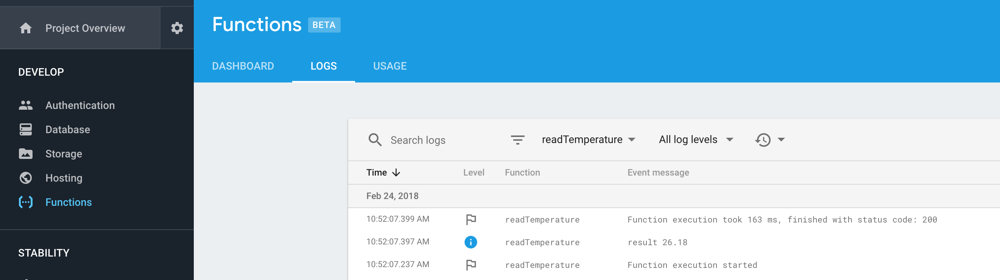

## Install the google actions

As default node doesn't come with the actions on google, so we need to install them, open your functions folder and install it with npm

`cd functions; npm install actions-on-google`


## Create your dialogFlow function

DialogFlow can communicate to cloud functions, for that to happen we need to create a function to handle those requests

- Create the new function
- Paste the code below in your `index.js` 

```
// index.js
const DialogflowApp = require('actions-on-google').DialogflowApp; // Google Assistant helper library

exports.dialogflowFirebaseFulfillment = functions.https.onRequest((request, response) => {
    console.log('Dialogflow Request headers: ' + JSON.stringify(request.headers));
    console.log('Dialogflow Request body: ' + JSON.stringify(request.body));
    
    return response.status(400).end('Not implemented');
});
```

- Save and deploy using `firebase deploy --only functions:dialogflowFirebaseFulfillment
- Copy the new link generated
`

## Creating your DialogFlow project 

Now that we have our DialogFlow function, we can create a project to use it

- Open the [DialogFlow console](https://console.dialogflow.com)
- Create a new agent
- Link it to your Firebase project
- Leave on version 1 for now

## Creating a new intent

- Create a new intent for our temperature read
- Add training phrases

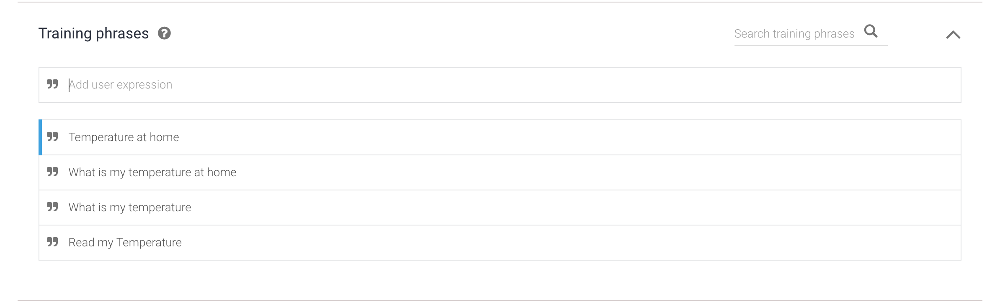

- Add the `input.temperature` action

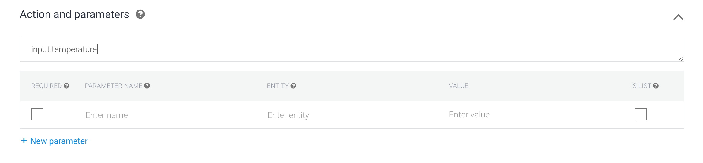

- Enable fulfillment
- Enable the webhook

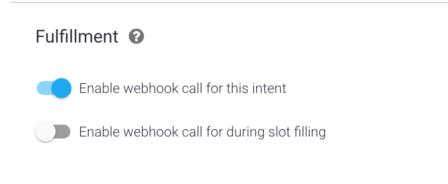

- Save

## Setting up the Webhook

- Open the Fulfillment tab
- Add the dialogflowFirebaseFulfillment function you copied above

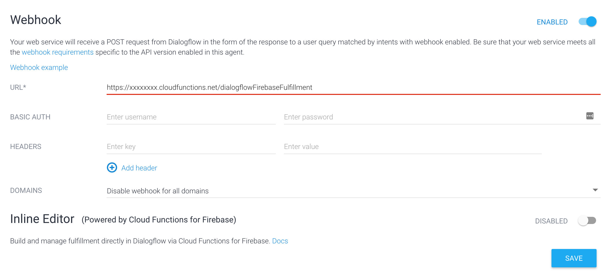

- On the top right of the page you can try your new intent
- Write `Temperate at home` 
- You will get an error, the reason for that is that we haven't implemented any DialogFlow answer on our function

## Implementing the DialogFlow logic in your cloud function

Now we can add a logic to our DialogFlow cloud function
The code below has a unknown request answer and one when the action is `input.temperature` as defined in our intent action, it also has the code to respond to DialogFlow

- Copy paste the code

```
function processRequest(request, response) {
    let action = request.body.result.action; // https://dialogflow.com/docs/actions-and-parameters
    let parameters = request.body.result.parameters; // https://dialogflow.com/docs/actions-and-parameters
    let inputContexts = request.body.result.contexts; // https://dialogflow.com/docs/contexts
    let requestSource = (request.body.originalRequest) ? request.body.originalRequest.source : undefined;

    const googleAssistantRequest = 'google'; // Constant to identify Google Assistant requests
    const app = new DialogflowApp({request: request, response: response});

    console.log("Received action: ", action);
    if (action === 'input.temperature') {
        temperatureRead();
    } else {
        unknownRequest()
    }

    function unknownRequest() {
        sendSimpleMessage('I\'m having trouble, can you try that again?');
    }

    function sendSimpleMessage(message) {
        if (requestSource === googleAssistantRequest) {
            sendGoogleResponse(message); // Send simple response to user
        } else {
            sendResponse(message); // Send simple response to user
        }
    }

    function temperatureRead() {
        var responseText = 'Unable to read temperature';
        admin.database().ref('/home').once('value', (snapshot) => {

            let result = parseFloat(Math.round(snapshot.val().temperature * 100) / 100).toFixed(2);
            responseText = 'Your temperature at home is: ' + result + "\n";
            console.log(responseText);

            // Use the Actions on Google lib to respond to Google requests; for other requests use JSON
            if (requestSource === googleAssistantRequest) {
                let responseToUser = {
                    speech: responseText,
                    text: responseText
                };
                sendGoogleResponse(responseToUser);
            } else {
                let responseToUser = {
                    //data: richResponsesV1, // Optional, uncomment to enable
                    speech: responseText,
                    text: responseText

                };
                sendResponse(responseToUser);
            }

        });
    }

    function sendGoogleResponse(responseToUser) {
        if (typeof responseToUser === 'string') {
            app.ask(responseToUser); // Google Assistant response
        } else {
            // If speech or displayText is defined use it to respond
            let googleResponse = app.buildRichResponse().addSimpleResponse({
                speech: responseToUser.speech || responseToUser.displayText,
                displayText: responseToUser.displayText || responseToUser.speech
            });
            // Optional: Overwrite previous response with rich response
            if (responseToUser.googleRichResponse) {
                googleResponse = responseToUser.googleRichResponse;
            }
            // Optional: add contexts (https://dialogflow.com/docs/contexts)
            if (responseToUser.googleOutputContexts) {
                app.setContext(...responseToUser.googleOutputContexts);
            }

            console.log('Response to Dialogflow (AoG): ' + JSON.stringify(googleResponse));
            app.ask(googleResponse); // Send response to Dialogflow and Google Assistant
        }
    }

    // Function to send correctly formatted responses to Dialogflow which are then sent to the user
    function sendResponse(responseToUser) {
        // if the response is a string send it as a response to the user
        if (typeof responseToUser === 'string') {
            let responseJson = {};
            responseJson.speech = responseToUser; // spoken response
            responseJson.displayText = responseToUser; // displayed response
            responseJson.data = responseToUser;
            response.json(responseJson); // Send response to Dialogflow
        } else {
            // If the response to the user includes rich responses or contexts send them to Dialogflow
            let responseJson = {};
            // If speech or displayText is defined, use it to respond (if one isn't defined use the other's value)
            responseJson.speech = responseToUser.speech || responseToUser.displayText;
            responseJson.displayText = responseToUser.displayText || responseToUser.speech;
            // Optional: add rich messages for integrations (https://dialogflow.com/docs/rich-messages)
            responseJson.data = responseToUser.data;
            // Optional: add contexts (https://dialogflow.com/docs/contexts)
            responseJson.contextOut = responseToUser.outputContexts;

            console.log('Response to Dialogflow: ' + JSON.stringify(responseJson));
            response.json(responseJson); // Send response to Dialogflow
        }
    }
}
```

- Deploy it again: `firebase deploy --only functions:dialogflowFirebaseFulfillment`
- Try your intent again `Temperate at home`

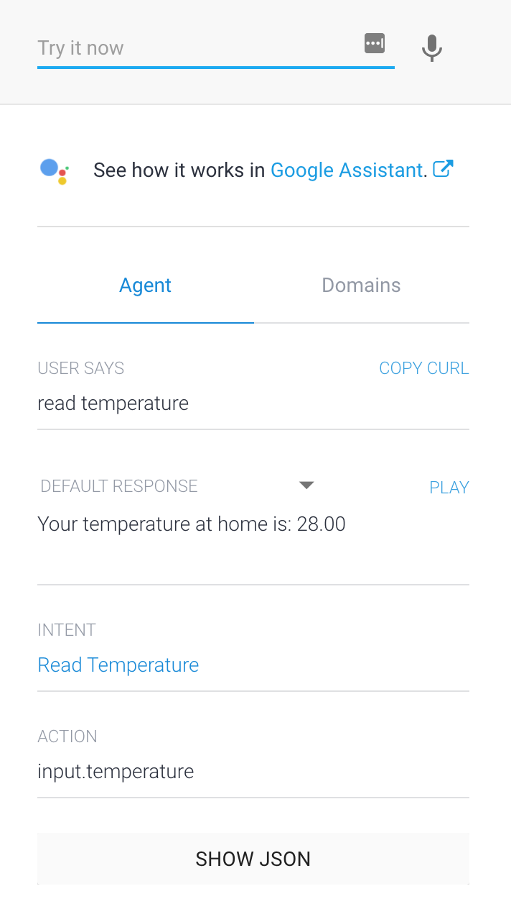


## Creating an intent with parameters

Now that we know how to interact with DialogFlow and cloud functions, lets use a function with parameters.
In this case, we are going to set our light object to true or false so that we can turn the light on our things on/off.
To be able to have the parameter, we create something called an entity.

- Create a new entity
- Call it `state`
- Add the data as below

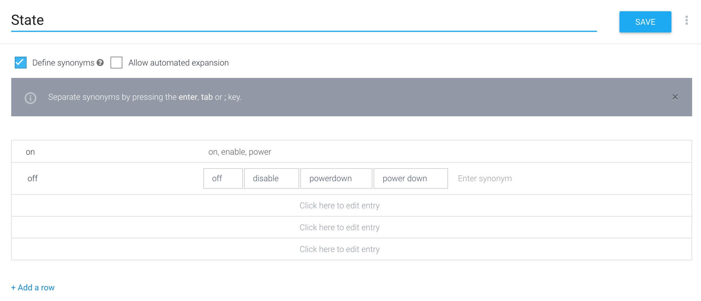


- Create a new intent with these phrases

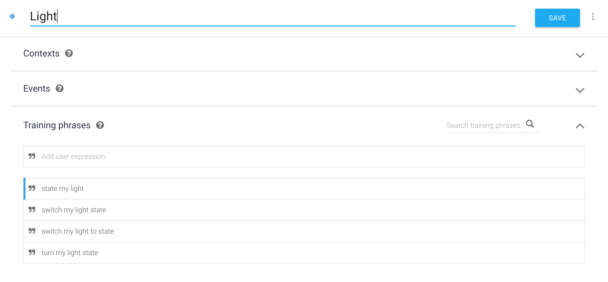

- You need to link the state to the action, so click on the state word and link to the state action

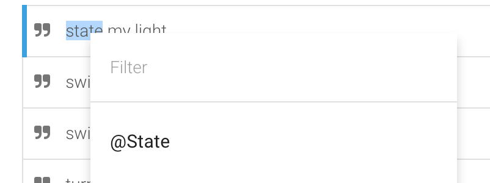

- Set the action name and the state to required

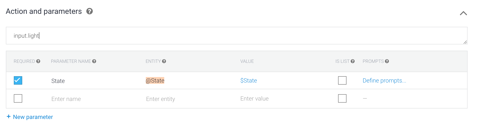


- Enable the fulfillment and paste the same webhook
- Test: `switch my light on`

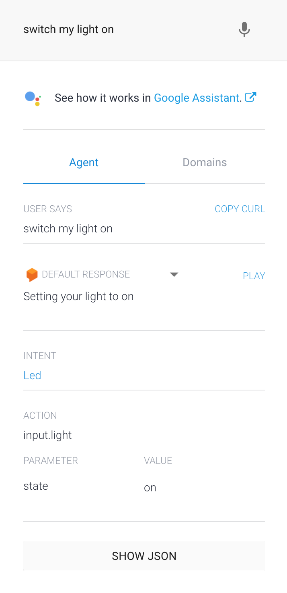

## Updating the cloud functions code

Add the light state code

``` 
    function setLight() {
        let state = parameters.state ? parameters.state : 'off';
        let value = state === 'on';
        writeToLightDb(value);
    }

    function writeToLightDb(value) {
        admin.database().ref('/home/light').set(value);
        sendSimpleMessage('Setting your light to ' + value);
    }
```

Update the action call

``` 
    console.log("Received action: ", action);
    if (action === 'input.temperature') {
        temperatureRead();
    } else if (action === 'input.light') {
        setLight();
    } else {
        unknownRequest()
    }
```

## Using the google assistant

Now that you have got your DialogFlow you can test it within your Google account.
You can test with the simulator, phone or Google home.

### Using the simulator

Before you deploy your app, you can test it with the simulator, phone or Google home. Here is how to do it with the simulator

- Select `See how it works in Google Assistant.` on the top right of the DialogFlow page
- Type `Talk to my test app`
- Interact with your app!
- Done!


### Using Google assistant on phone or Google Home

Its easy as pie, just say/type `Talk to my test app` and interact with your new app!

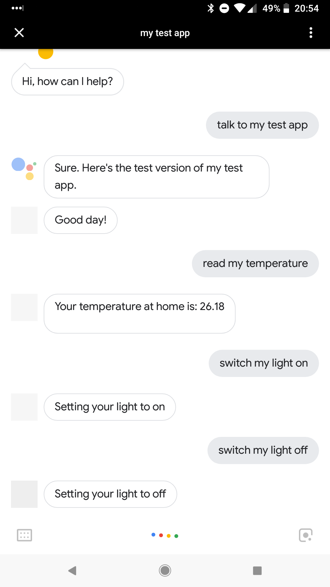

- Once finished say `Goodbye` 


