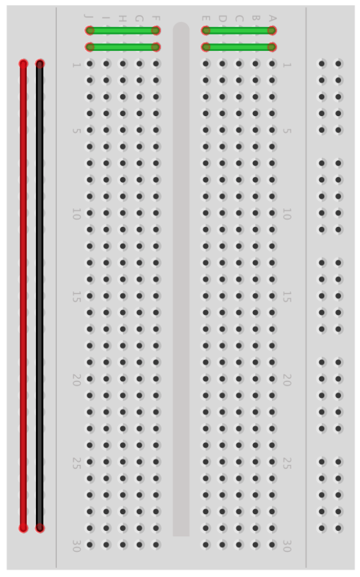
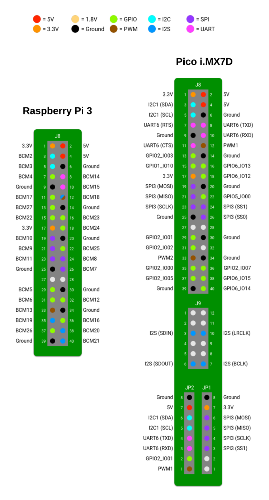
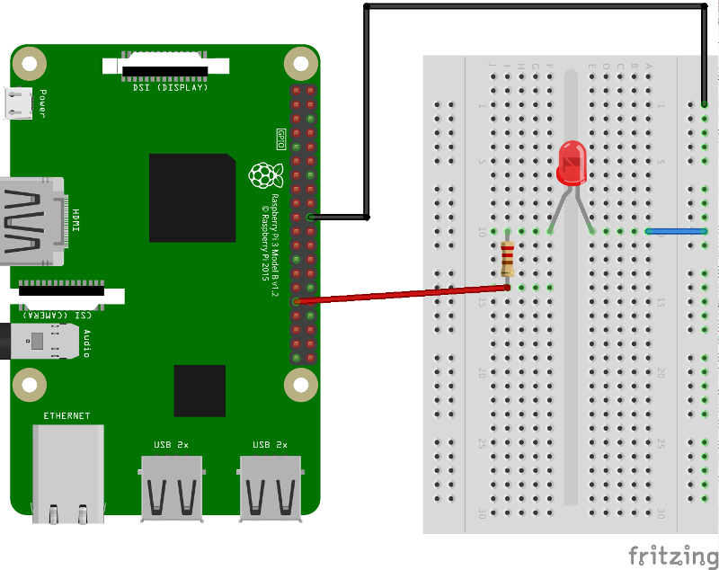
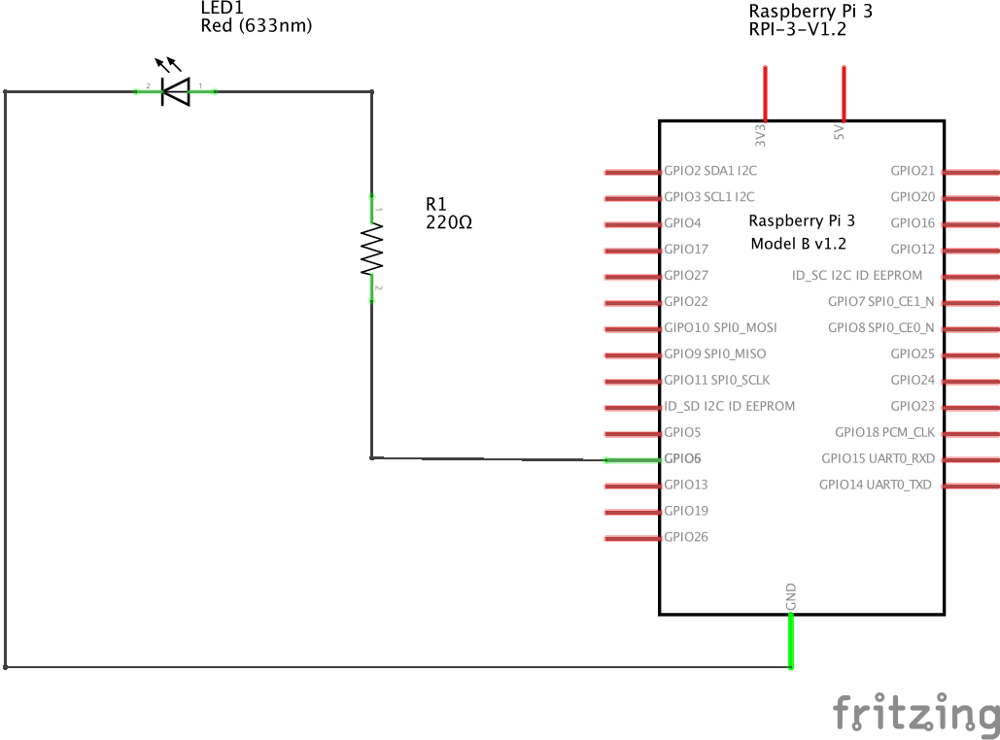

### Introduction

In this first task you will use AndroidThings to turn on an LED. This will be our way to get something basic running, a bit like a Hello World program. Although it may sound simple, turning on an LED is a good way to get yourself familiarised with the IoT board, hardware components as well as the AndroidThings environment. It will also give you an introduction on creating circuits that interact with the real world! Before you get started, here is a list of components you will need for this exercise.


### Hardware Components
1. Breadboard
A breadboard is the construction base for all your electronic circuits. It provides an easy way to connect your components without requiring soldering. As per the breadboard diagram, the holes in the centre are connected by conductive metal strips horizontally while the holes on the edges are connected vertically.


2. Jumper wires
Generic all purpose wires used to connect your board to the components on the breadboard together.

3. Resistors
Essential parts of your electronic circuit as they primarily protect your components by limiting the amount of current flowing through them. Each component has a maximum current that it can handle and if the current going through them exceeds their rated value, they will get damaged and in some cases blow up! The resistance of a resistor is determined by the stripes. For this task, the resistor used will have a resistance of 220Ω

4. LEDs
LED stands for Light Emitting Diode and it will emit light when a current flows through them. LEDs only allows electricity to flow in one direction meaning that they will only light up if connected with the correct polarity. The short leg of the LED is the cathode (-ve) and the long leg is the anode (+ve). The anode is the end that connects to power. Note that LEDs can only handle a maximum current of about 23mA

### Ohm's Law
Ohm's Law comes in very handy when designing electronic circuits and deciding how to connect our components. It states that the current through a conductor between two points is directly proportional to the voltage across the two points whereby the constant of proportionality is the inverse of electrical resistance. I = V/R
Ohm's Law will help us to select an appropriate resistor to protect our LED.

### GPIO Pins
GPIO (General Purpose Input Output) pins give a physical interface between your board (Raspberry Pi or other Android Things supported boards) and the breadboard. GPIO pins allow you to read and write values to the various sensors that you would use throughout your various IoT projects and interact with the real world. The pin layout varies depending on the board manufacturer but all you need to do is refer to the board's pinout diagram.

Below is an example of the pinout diagram for the Raspberry Pi 3 and the Pico i.MXP7:


For more information please visit: https://developer.android.com/things/hardware/index.html

### Blinking LED Android Things Circuit
The diagram below illustrates how to build your first circuit for this blinking LED exercise. The first diagram shows how to connect your components together. Very often, the actual physical representation of the circuit connection is not clear due to how the components and pins are arranged on the board. In order to make this easier to understand, the schematic diagram is provided underneath. A schematic diagram aims at clearly explaining how various components are connected together throughout your circuit design by greatly simplifiying the represenation of each component. 
Please note that the longer leg of the LED is the one connecting to the resistor.

#### Connection Diagram


#### Schematic Diagram


### Selecting An Appropriate Resistor
As mentioned previously, LEDs take a maximum of about 23mA. LEDs are essentially diodes and offer little resistance when subjected to a voltage. It is therefore very important to select an appropriate resistor to avoid damaging the LED. This is where Ohm's Law comes in handy.

Here is how to calculate a suitable resistor

Current = Voltage / Resistance

```
I = V / R

0.023 = 5 / R

R = 5 / 0.023

R = 217.39Ω
```

Looking at the available resistors that can be obtained off the shelf, it looks like a 220Ω resistor will be just fine!

### Choosing A GPIO Pin
As you can see, the Raspberry Pi 3 as well as the Pico MXP7 have several pins and it is important to select an appropriate pin. The pins fulfill different purposes depending on your application but for this task, we only need to pick one to write data to the LED to turn it on. For more information on the different uses of each pin, please refer to the manufacturer's website or datasheet. The GPIO pin we will choose on the Pi will be BCM6 while the one on the MXP will be GPIO2.

### Blinking LED Android Things App
Please follow the instructions from the Android Things website in order to get started and install the Android Things OS onto your board. https://developer.android.com/things/hardware/raspberrypi.html

Once you have Android Things successfully running on the Pi or MXP, launch Android Studio and do the following:
1.  Create a new project and create a blank activity. Feel free to give it any meaningful name. Let's go with BlinkLedActivity.
2.  In your app level `build.gradle`, add the Android Things dependency

```
dependencies {
  provided 'com.google.android.things:androidthings:0.1-devpreview'
}
```
3.  Add the `<users-library>` tag to AndroidManifest. This implies that the Android Things library is needed by the app

```
<application>
    <uses-library android:name="com.google.android.things"/>
</application>
```

4. In order for BlinkLedActivity to launch once the board is booted, it has to be defined as the launcher activity in AndroidManifext. This can be done as follows

```
<activity android:name=".BlinkLedActivity">.
    <!-- Required for Android Studio default launching -->
    <intent-filter>
        <action android:name="android.intent.action.MAIN"/>
        <category android:name="android.intent.category.LAUNCHER"/>
    </intent-filter>

    <!-- Launch this activity on boot -->
    <intent-filter>
        <action android:name="android.intent.action.MAIN"/>
        <category android:name="android.intent.category.IOT_LAUNCHER"/>
        <category android:name="android.intent.category.DEFAULT"/>
    </intent-filter>
</activity>
```

5.  Now let's get started and build our app logic. Feel free to use Java if you are more comfortable but since Kotlin is the cool kid on the block these days for Android development, we will use Kotlin throughout our examples. Note that the code we will show you is one of the several ways of achieving a blinking LED so do not be hesitate to try a different implementation.
We begin by creating a class called Led which implements the AutoCloseable interface. This will require us to implement the `close()` method and provide a methodology to make sure the resources are closed once the operation has completed.
The `PeripheralManagerService` class is one of the main classes of the Android Things library and is responsible for listing and opening peripherals on your board. We will use it to write data to pin BCM6 and turn on our LED. 
The pin direction is initially set to `DIRECTION_OUT_INITIALLY_LOW` because we want the pin to output data to the LED and the starting voltage to be low.

```
class Led(val pinName: String) : AutoCloseable {

    private var gpio: Gpio? = null

    init {
        val service = PeripheralManagerService()
        gpio = service.openGpio(pinName)
        gpio?.setDirection(Gpio.DIRECTION_OUT_INITIALLY_LOW)
    }

    fun blink() {
        gpio?.value = !gpio?.value
    }

    override fun close() {
        gpio?.close().also {
            gpio = null
        }
    }
}
```

6. In the BlinkLedActivity, we can now create an instance of Led in `onCreate` and implement a `Runnable` to handle the blinking as well as a 1 second delay.

```
class BlinkLedActivity : Activity() {

    private lateinit var led
    private val ledHandler = Handler()

    protected fun onCreate(savedInstanceState: Bundle) {
        super.onCreate(savedInstanceState)
        setContentView(R.layout.activity_blink)

        try {
            led = Led("BCM6")
            ledHandler.post()
        } catch (e: IOException) {
            throw RuntimeException("Error connecting to IO Port", e)
        }
    }

    protected fun onDestroy() {
        super.onDestroy()
        try {
            led.close()
        } catch (e: IOException) {
            Log.e(TAG, "Error on closing GPIO", e)
        }
    }

    private fun ledRunnable(): Runnable = Runnable() {
        override fun run() {
            try {
                led.blink()
                ledHandler.postDelayed(ledRunnable, DELAY)
            } catch (IOException e) {
                Log.e(TAG, "Error on peripheral", e)
            }
        }
    }

    companion object {
        const val TAG = "BlinkLedActivity"
        const val DELAY = 1000
    }
    
}
```

7. Run the app and you should see your first Android Things Blinking LED! 🚨
