## Setup

Since the Firebase services are stored in the cloud, we need to setup the wifi on our Android Things so it can communicate to the internet.

To setup the wifi on your Android Things you can use the setup utility tool or use the command below.
Setup wifi on your Android Things, replace the `$HERE` values
```
adb shell am startservice -n com.google.wifisetup/.WifiSetupService -a WifiSetupService.Connect -e ssid $YOUR_SSID_HERE -e passphrase $YOUR_WIFI_PASSWORD_HERE
```

To make the lesson easier, the base code for it is already done (based on the previous tasks)
So clone this repository and open the `worshopapps` folder.

If you have any issues, you can checkout the `firebase-setup` branch and look at the implemented code.

This project contains 3 modules: 
- common: where the common code between the modules is stored
- things: this is our Android Things application
- mobile: this is our mobile phone application

---
## Connect the pins

Now that we have our software setup, we need to connect our hardware together.
The pins are same as the previous tasks, so if you are already setup, you don't need this.


---
## Create a Firebase project

### Step 1

There are 2 ways to setup Firebase, one is to go in the [console](https://console.firebase.google.com) and created your own project, or you can use Android Studio to do ir for your.

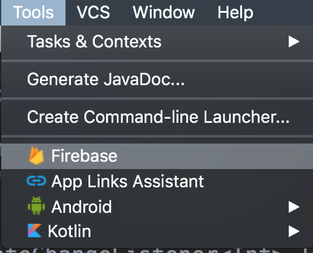

---
### Step 2

Android Studio will open a new tab that gives your a list of all the features you can automatically install.
In this case we wan't to use the Firebase Realtime database.

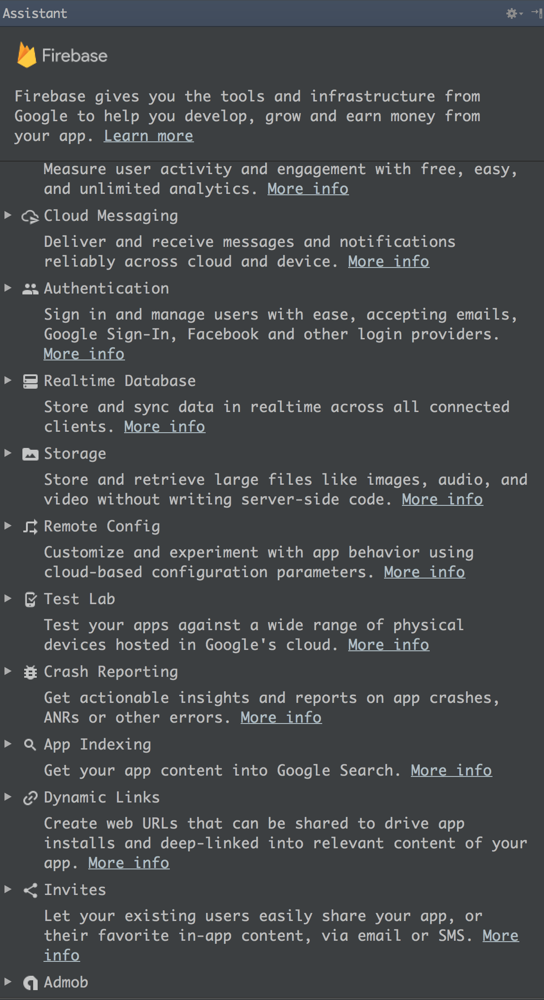

---
### Step 3

Select the option

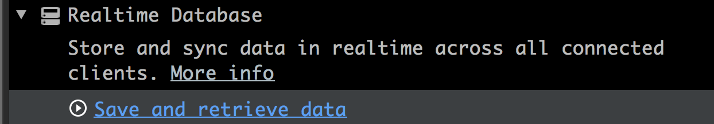

---
### Step 4
First of all, you need to connect your Android Studio to Firebase, so select the button connect to Firebase

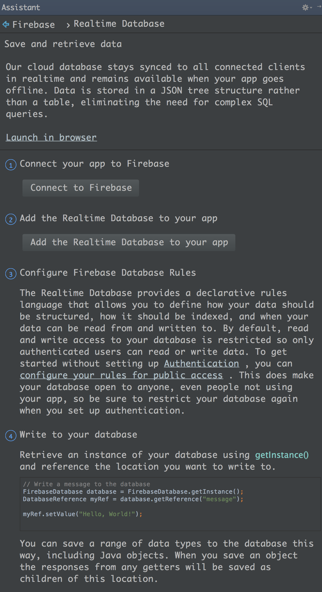

---
### Step 5

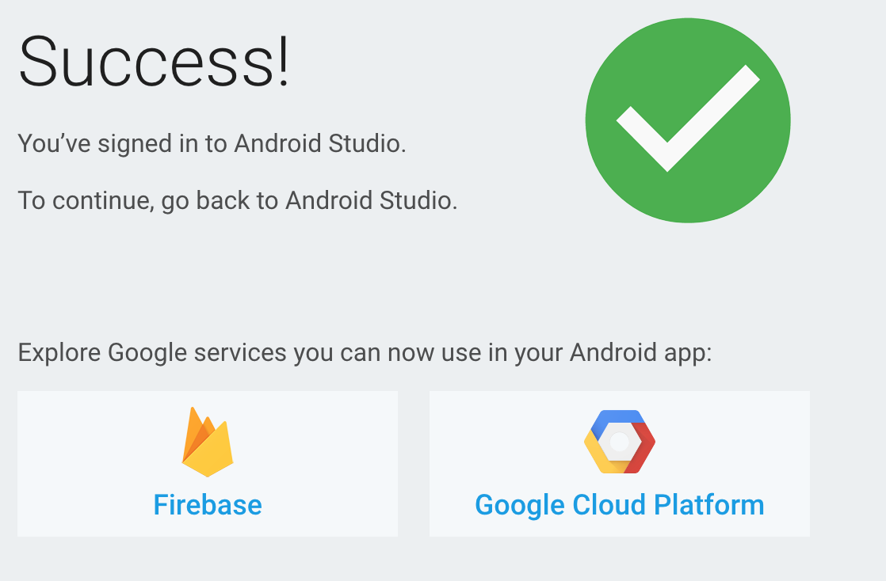

---
### Step 6

You need to select what project you want to connect, or you can create a new one.

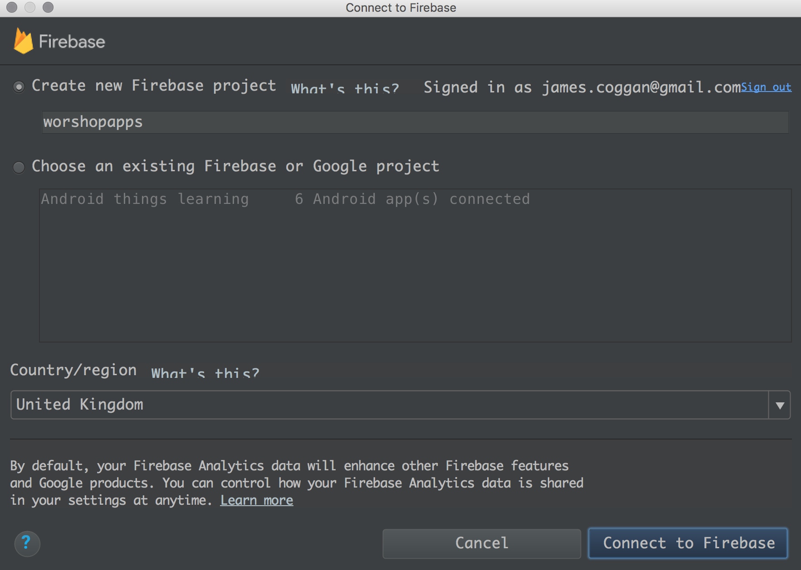

---
### Step 7

Once connected you can choose the module you want to connect to Firebase

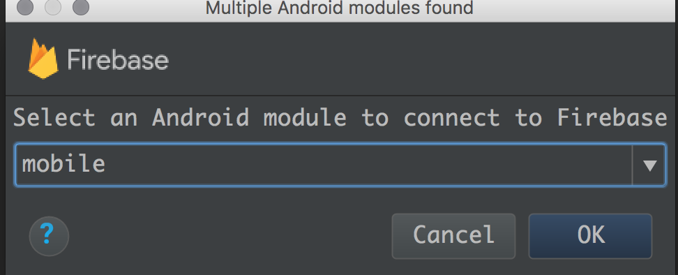

---
### Step 8

And add the changes to your gradle files. In this case we wan't to connect both

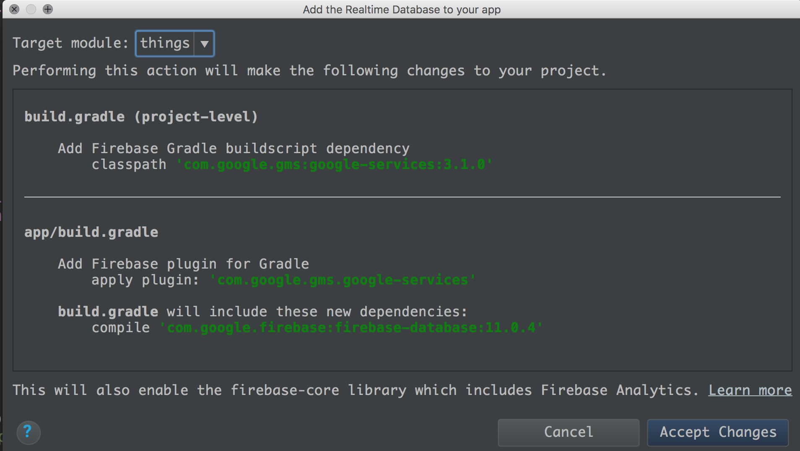

---
### Step 9

You have added one module to the Firebase project, you need to do the same for the other module, go back to step 6 and do it for the second module

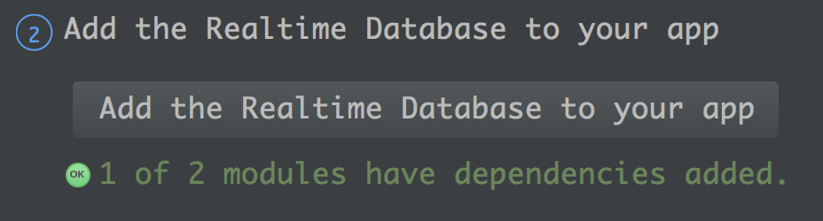

---
### Step 10

Now open the [Firebase Console](https://console.firebase.google.com)

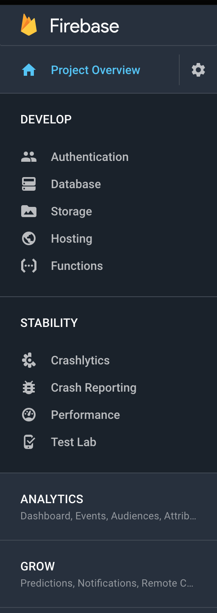

---
### Step 11

And open the authentication tab


---
### Step 12

For this lesson we are going to use the anonymous login, but remember you need to change this for a production build.
So select the anonymous option.

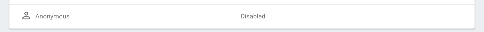

---
### Step 13

And activate it

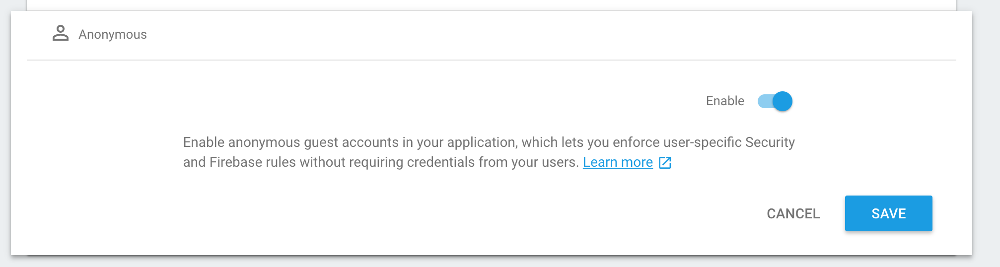

---
## Setup Firebase on the common module

Now that you have the Firebase project setup, we can now setup the common module.
The idea of the common module is to isolate the logic for future testing and reusability between the mobile and things module.

### Step 14

Add the required dependencies to the common module

``` // commond/build.gradle
    implementation 'com.google.firebase:firebase-database:11.0.4'
    implementation 'com.google.firebase:firebase-auth:11.0.4'
    implementation "com.google.android.gms:play-services-base:11.0.4"
    implementation "android.arch.lifecycle:extensions:1.1.0"
```

---
### Step 15

In the Firebase database we are going to store: light, temperature and button. To make it more clean we are going to create the HomeInformation data class that contains these 3 objects.

```
// HomeInformation.kt
data class HomeInformation(var button: Boolean = false,
                           var light: Boolean = false,
                           var temperature: Float = 0f)
```

---
### Step 16

We want to observe data changes for the HomeInformation reference in the database.
For better isolation of the code, we are going to use LiveData from the Architectural Components, we could use the value listener direct or implement LiveData on it. 

```
// HomeInformationLiveData.kt
class HomeInformationLiveData(private val databaseReference: DatabaseReference) : LiveData<HomeInformation>() {

    private val valueEventListener = object : ValueEventListener {
        override fun onDataChange(snapshot: DataSnapshot) {
            val newValue = snapshot.getValue(HomeInformation::class.java)
            Timber.d("New data received! $newValue")
            value = newValue
        }

        override fun onCancelled(error: DatabaseError) {
            Timber.w(error.toException(), "onCancelled")
        }
    }

    override fun onActive() {
        databaseReference.addValueEventListener(valueEventListener)
    }

    override fun onInactive() {
        databaseReference.removeEventListener(valueEventListener)
    }
}
```

---
### Step 17

On the other side, we want to store data in the database, so we are going to isolate the logic in a similar way and create the HomeInformationStorage class

```
// Common module - HomeInformationStorage.kt
class HomeInformationStorage(private val reference: DatabaseReference) {
    companion object {
        private const val HOME_INFORMATION_LIGHT = "light"
        private const val HOME_INFORMATION_BUTTON = "button"
        private const val HOME_INFORMATION_TEMPERATURE = "temperature"
    }

    fun saveLightState(isOn: Boolean) {
        reference.child(HOME_INFORMATION_LIGHT).setValue(isOn)
    }

    fun saveButtonState(isPressed: Boolean) {
        reference.child(HOME_INFORMATION_BUTTON).setValue(isPressed)
    }

    fun saveTemperature(temperature: Float) {
        reference.child(HOME_INFORMATION_TEMPERATURE).setValue(temperature)
    }
}
```

---
### Step 18

Now that we have the common module setup to read/write in Firebase, now is the time to add the logic to our modules, first lets start with Android Things.

## Setup Firebase on the Things

Before we can read/store data we need to connect to Firebase, then once connected we can observe the data.
So we are going to add the dependencies, load the FirebaseApp on our app creation, and login when our activity is started.

``` 
// things/build.gradle
implementation 'com.google.firebase:firebase-database:11.0.4'
implementation 'com.google.firebase:firebase-auth:11.0.4'
implementation "com.google.android.gms:play-services-base:11.0.4"
implementation "android.arch.lifecycle:extensions:1.1.0"
```

```
// ThingsApplication.kt
FirebaseApp.initializeApp(this)
```

```
    // MainActivity.kt
    private fun loginFirebase() {
        val firebase = FirebaseAuth.getInstance()
        firebase.signInAnonymously()
                .addOnSuccessListener { observeData() }
                .addOnFailureListener { Timber.e("Failed to login $it") }
    }

    override fun onStart() {
        super.onStart()
        ...
        loginFirebase()
    }    
```

---
### Step 19

On the same activity, we need to setup or LiveData and storage, so on our observeData we are going to load our database reference and create the instances of those objects.
For our implementation of the observer, when we receive the light object, we set that value in the LED.

```
    // Homeactivity.kt Things
    private var homeInformationLiveData: HomeInformationLiveData? = null
    private var homeInformationStorage: HomeInformationStorage? = null

    private val homeDataObserver = Observer<HomeInformation> { led.setState(it?.light ?: false) }
    
    override fun onStop() {
        homeInformationLiveData?.removeObserver(homeDataObserver)
        ...
    }
    
    private fun observeData() {
        Timber.d("Logged in, observing data")
        val reference = FirebaseDatabase.getInstance().reference.child("home")
        homeInformationLiveData = HomeInformationLiveData(reference)
        homeInformationLiveData?.observe(this, homeDataObserver)
        homeInformationStorage = HomeInformationStorage(reference)
    }    
```

---
### Step 20

On the case of the button and temperature changes, we are going to store them in our database when changed.

```
    // MainActivity.kt
    private fun onSwitch(state: Boolean) {
        Timber.d("Button pressed: $state")
        homeInformationStorage?.saveButtonState(state)
        homeInformationStorage?.saveLightState(state)
    }

    private fun onTemp(state: Int) {
        Timber.d("Current Temperature: $state")
        homeInformationStorage?.saveTemperature(state.toFloat())
    }
```

Now you can launch your Android Things app. 
If you open the Firebase Console, and expand your database, you will see something similar than the image below, where the data is being updated from the Android Things.

[](images/step16.png)

## Setup Firebase on the Mobile

No we need to do the same approach in the mobile app, with some slight differences.

---
### Step 20

Same as the things application, we need to load our FirebaseApp on app creation and login into Firebase on activity load.
For the case of the mobile app we are using the onResume method instead.

```
// mobile/build.gradle
implementation 'com.google.firebase:firebase-database:11.0.4'
implementation 'com.google.firebase:firebase-auth:11.0.4'
implementation "com.google.android.gms:play-services-base:11.0.4"
implementation "android.arch.lifecycle:extensions:1.1.0"
```

```
// MobileApplication.kt
FirebaseApp.initializeApp(this)
```

```
    // MainActivity.kt
    override fun onResume() {
        super.onResume()

        loginFirebase()
    }
    
    private fun loginFirebase() {
        val firebase = FirebaseAuth.getInstance()
        firebase.signInAnonymously()
                .addOnSuccessListener { observeData() }
                .addOnFailureListener { Timber.e("Failed to login $it") }
    } 
```

---
### Step 21

On the mobile app we want to be able to interact with the database changes, so we need to create a few UI elements in our layout file

```
<!-- activity_main.xml -->
<?xml version="1.0" encoding="utf-8"?>
<LinearLayout xmlns:android="http://schemas.android.com/apk/res/android"
    xmlns:tools="http://schemas.android.com/tools"
    android:layout_width="match_parent"
    android:layout_height="match_parent"
    android:orientation="vertical"
    tools:context="com.jamescoggan.workshopapp.MainActivity">

    <TextView
        android:id="@+id/temperature_status"
        android:layout_width="wrap_content"
        android:layout_height="wrap_content"
        tools:text="Temperature: 29 °C" />

    <TextView
        android:id="@+id/button_status"
        android:layout_width="wrap_content"
        android:layout_height="wrap_content"
        tools:text="Button is pressed" />

    <TextView
        android:id="@+id/led_status"
        android:layout_width="wrap_content"
        android:layout_height="wrap_content"
        tools:text="Led is on" />

    <ToggleButton
        android:id="@+id/led_button"
        android:layout_width="wrap_content"
        android:layout_height="wrap_content" />

</LinearLayout>
 
```

---
### Step 22

Now we setup the observer of the data changes and set the UI accordingly
Also remember to stop observing the data on pause.

```
    // MainActivity.kt
    private var homeInformationLiveData: HomeInformationLiveData? = null
    private var homeInformationStorage: HomeInformationStorage? = null

    private val homeDataObserver = Observer<HomeInformation> {
        val ledText = "Led is " + if (it?.light == true) "on" else "off"
        led_status.text = ledText

        val buttonText = "Button is " + if (it?.button == true) "pressed" else "not pressed"
        button_status.text = buttonText

        val tempText = "Temperature: ${it?.temperature} °C"
        temperature_status.text = tempText

        led_button.isChecked = it?.light ?: false
    }   
```

---
### Step 23

Now we can observe the data after the login success

``` 
    // MainActivity.kt
    private fun observeData() {
        Timber.d("Logged in, observing data")
        val reference = FirebaseDatabase.getInstance().reference.child("home")
        homeInformationLiveData = HomeInformationLiveData(reference)
        homeInformationLiveData?.observe(this, homeDataObserver)
        homeInformationStorage = HomeInformationStorage(reference)
    }
    
    override fun onPause() {
        homeInformationLiveData?.removeObserver(homeDataObserver)

        super.onPause()
    }    
```

---
### Step 24

For our toggle button, we wan't to save its state selection in the led object of the database.

```
    // MainActivity.kt
    override fun onCreate(savedInstanceState: Bundle?) {
        super.onCreate(savedInstanceState)
        setContentView(R.layout.activity_main)

        led_button.setOnCheckedChangeListener { _, state -> setLed(state) }
    }
    
    private fun setLed(state: Boolean) {
        homeInformationStorage?.saveLightState(state)
    }
```
