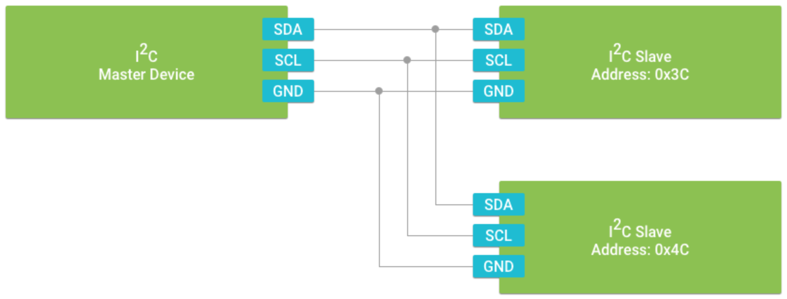
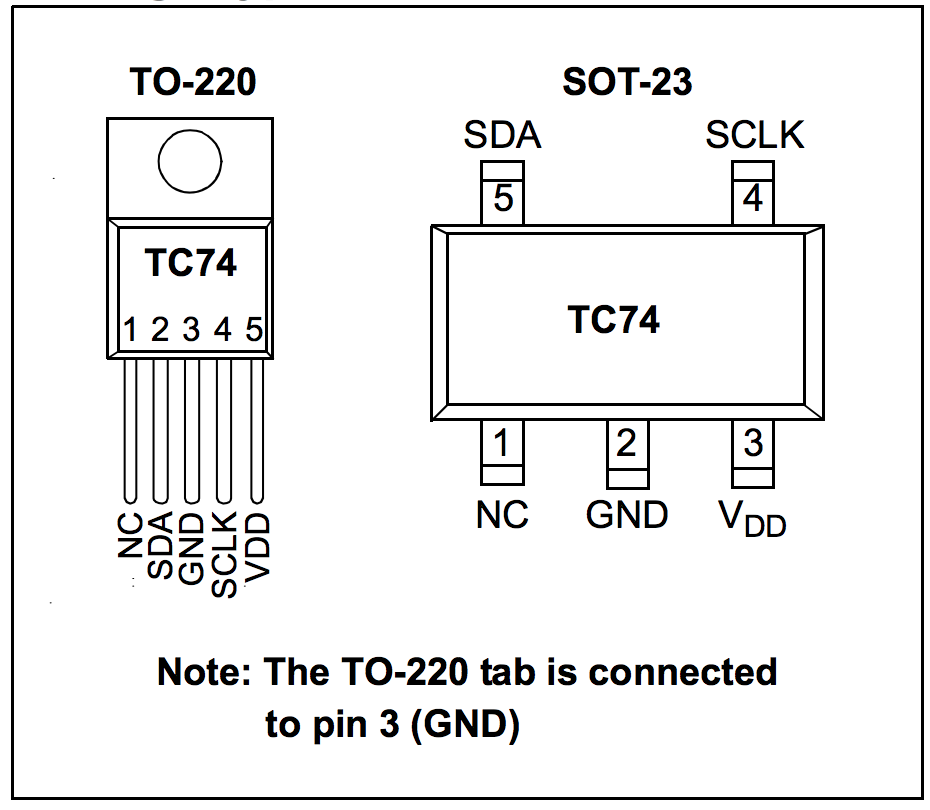
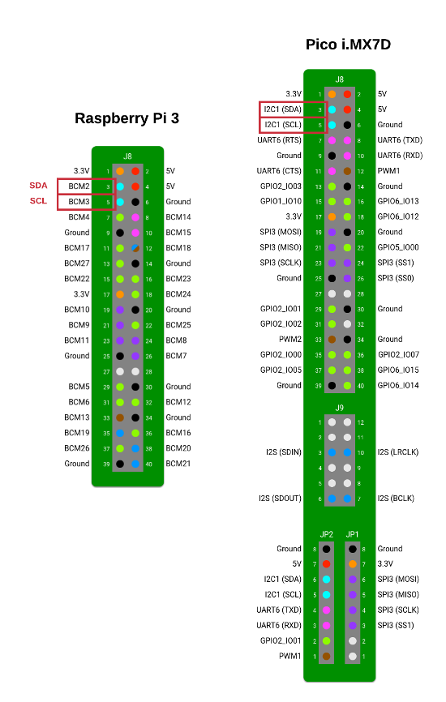
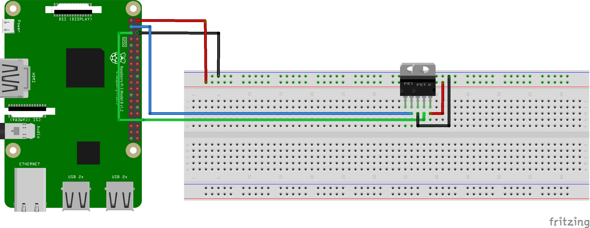

### Introduction

In the previous exercise, you wrote data to an LED using Android Things and made it blink 🚨 Amazing work! 
For this upcoming task, you will now learn about reading data from a temperature sensor using Inter-Integrated Circuit or more commonly referred to as I2C. I2C is a bus protocol allowing a master to control multiple slave devices such as sensors or actuators, connected to this bus.

### Inter-Integrated Circuit (I2C)

As mentioned above, I2C is a bus protocol that allows a master to control several peripheral devices using a simple data payload. When designing your IOT system, common sensors and actuators you would use include accelerometers, thermometers, LCD displays, and motor drivers. 

I2C is a synchronous serial interface, which means that it relies on a shared clock signal to synchronise data transfer between devices. The device in control of triggering the clock signal is known as the **master**. All other connected peripherals are known as **slaves**. Each device is connected to the same set of data signals to form a bus.

I2C devices connect using a 3-Wire interface consisting of:

* Shared clock signal (SCL)
* Shared data line (SDA)
* Common ground reference (GND)

Also note that I2C is **half-duplex** meaning that it only communication between master and slave can occur in both directions but cannot occur simultaenuously. The master initiates the communication and the slave must respond once the transmission is complete.  
Each device must have a unique address to disambiguate the commands sent. Some devices use the notion of register (also called commands), allowing you to select a memory address to read from/write to. The datasheet for your device will explain what each register is used for. Opening an I2C device takes ownership of it for the whole system, preventing anyone else from opening/accessing this device until you call `close()`. Forgetting to call `close()` will prevent anyone including the same process or app from using the device.



For more information, please refer to https://developer.android.com/things/sdk/pio/i2c.html

### Hardware Components

1. Breadboard

    A breadboard is the construction base for all your electronic circuits. It provides an easy way to connect your components without requiring soldering. As per the breadboard diagram, the holes in the centre are connected by conductive metal strips horizontally while the holes on the edges are connected vertically.


2. Jumper wires

    Generic all purpose wires used to connect your board to the components on the breadboard together.
    
3. TC74 Temperature Sensor

    The TC74 is a serially accessible, digital temperature sensor particularly suited for low cost and small form-factor applications.
    You can find the datasheet here: 


### TC74 Digital Temperature Sensor Pinout



From the TC74 datasheet, we can identify the following:

| Pins  | Symbol  | Description                                               |
| ----- |:-------:|:----------------------------------------------------------|
| 1     | NC      | No internal connection, which means we will not need this |
| 2     | SDA     | I2C Bi-directional line for serial data                   |
| 3     | GND     | System ground                                             |
| 4     | SCLK    | I2C input for the serial clock                            |
| 5     | VDD     | Power supply input to operate the temperature sensor      |


Looking at the Raspberry Pi 3 and Pico i.MXP7 pinout diagrams, we have the following dedicated pins for SDA and SCLK



This is perfect and exactly what we need! As a bonus, the pin numbers are exactly the same! 🎉

### Temperature Sensor Android Things Circuit

Connecting the temperature sensor to your Android Things device is very simple and straight forward. 



### Reading Temperature Data

Assuming your Android project has already been set up following the Blink LED exercise, we can dive straight into the main code that will allow reading temperature data.

In the `onCreate()` we can call on the `PeripheralManagerService()`. In order to open an I2C connection to our temperature sensor, the `openI2cDevice()` method takes two parameters:

1. The pin address as specified by your Raspeberry Pi 3 or Pico i.MXP7 datasheet. In our case it will be "I2C1"
2. The I2C peripheral address as specified by the TC74 datasheet. From the documentation, the default address is 1001 101b which translates to 0x77

```
private lateinit var service: PeripheralManagerService
private lateinit var i2cDevice: I2cDevice

override fun onCreate(savedInstanceState: Bundle?) {
    super.onCreate(savedInstanceState)

    try {
        i2cDevice = service.openI2cDevice(I2C_ADDRESS, TC74_TEMPERATURE_SENSOR_SLAVE)
    } catch (e: IOException) {
        throw IllegalStateException("$I2C_ADDRESS bus slave $TC74_TEMPERATURE_SENSOR_SLAVE connection cannot be opened.", e)
    }
}
```

Next step is to read the actual temperature data. This is done in two steps:
1. First we need to tell the sensor we want to read a byte array of size 1
2. The sensor will then set the data and we can then read from it

A simple implementation is shown below:

```    
while (true) {
    val array = ByteArray(1)
    i2cDevice.write(array, 1)

    val input = ByteArray(1)
    i2cDevice.read(input, 1)

    val temperature: Int = input[0].toInt() and 0xff
    Log.e("Sensor", "$temperature")

    Thread.sleep(3000)
}

```

Once we have some data in our byte array, we can then read from it and log it. By AND-ing the value from the byte array with `0xFF`, we ensure that we are only left with the least significant bits. This is typicaly referred to as masking. If your byte value is only 8 bit, it is not needed as masking will have no effect. If it is higher however, masking will have the following effect:

```
    0 1 0 1 0 1 0 1 0 1 0 1 0 1 0 1
 &  0 0 0 0 0 0 0 0 1 1 1 1 1 1 1 1
    -------------------------------
    0 0 0 0 0 0 0 0 0 1 0 1 0 1 0 1
```

Finally we call the `close()` method in the `onDestroy()` method. This is because we want to free up the temperature sensor resources and make it accessible again when no longer in use. 

```
override fun onDestroy() {
    super.onDestroy()
    i2cDevice.close()
}
```
